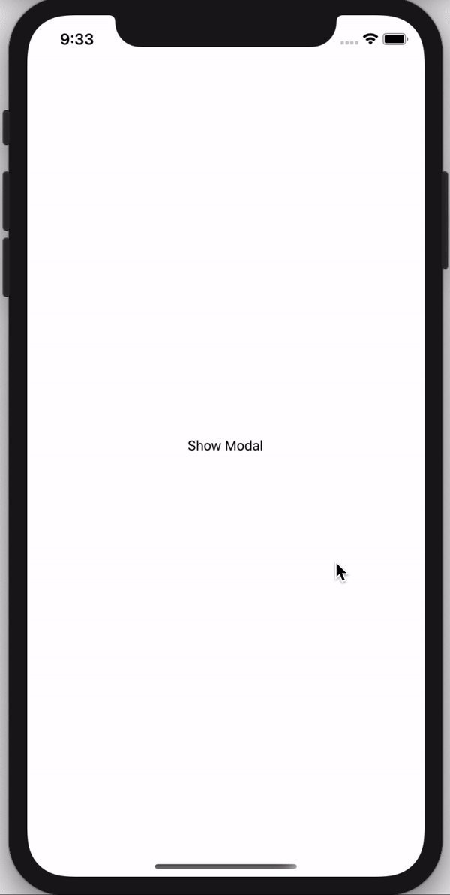

# react-native-modal-swipe


[](https://www.npmjs.com/package/react-native-modal-swipe)

## Getting started

`$ npm install react-native-modal-swipe --save`
 


## Usage
```javascript
// Import react-native-modal-swipe in your component
import React, { useState } from 'react';
import { View, Text, TouchableOpacity, Image, StyleSheet } from 'react-native';
import ModalSwipe from 'react-native-modal-swipe';

export default () => {
  const [visible, setvisible] = useState(false)
  const onChangeMoadl = () => {
    setvisible(!visible)
  }
  return (
    <>
      <TouchableOpacity style={styles.showModalBtn} onPress={onChangeMoadl}>
        <Text>Show Modal</Text>
      </TouchableOpacity>
      <ModalSwipe visible={visible} onClose={onChangeMoadl} layoutBackgroundColor="#fff">
        <>
          <View>
            <Text style={styles.title}> ! Paper Plane</Text>
            <Text style={styles.smallText}>Lorem Ipsum is simply dummy text of the printing and typesetting industry.</Text>
          </View>

          <Image
            style={styles.modalImage}
            source={require('./assets/images/Paper-Plane-Transparent.png')}
          />
          <View style={styles.modalContainer}>
            <Text style={styles.modalText}>JOIN PREMIUM</Text>
          </View>
        </>
      </ModalSwipe>
    </>
  )
};

const styles = StyleSheet.create({
  showModalBtn: {
    flex: 1,
    justifyContent: 'center',
    alignItems: 'center'
  },
  modalContainer: {
    backgroundColor: 'rgba(0, 0, 0, 0.2)',
    width: null,
    borderColor: '#FFFFFF',
    borderWidth: 1.5,
    borderRadius: 100,
    shadowColor: "#000",
    shadowOffset: {
      width: 5,
      height: 2,
    },
    shadowOpacity: 0.1,
    shadowRadius: 3.84,
    elevation: 5,
    marginBottom: 20
  },
  modalText: {
    color: '#fff',
    fontWeight: 'bold',
    marginHorizontal: 30,
    marginVertical: 15
  },
  modalImage: {
    height: 250,
    width: 200,
    resizeMode: 'center'
  },
  title: {
    fontSize: 22,
    marginVertical: 10
  },
  smallText: {
    fontWeight: '500',
    fontSize: 16
  }
});
```
## Properties

| Prop  | Default  | Type | Description |
| :------------ |:---------------:| :---------------:| :-----|
| visible | false | `Boolean` | Show the modal |
| onClose | - | `Function` | onClose the modal it's call the function |
| children | - | `element` | You can pass your own view here it will render on modal |
| layoutBackgroundColor | rgba(0, 0, 0, 0.6) | `String` | Modal BackDrop color |
| backgroundColor | rgba(255, 146, 43, 0.8) | `String` | Show the modal BackGround color |

